# amazon-connect-agentless-outbound-campaign

## Overview

[Amazon Connect Outbound Campaign](https://aws.amazon.com/connect/outbound)  is a feature of cloud-based contact center [Amazon Connect](https://aws.amazon.com/connect/) by Amazon Web Services (AWS) that allows businesses to proactively reach out to customers. 

Using Amazon Connect Outbound Campaign, businesses can create automated outbound campaigns to connect with their customers for various use cases, such as appointment reminders, service notifications, marketing offers, and customer surveys. 

Amazon Connect Outbound Campaign can be configured to be used with agents or agentless.

Below solution showcases how to use 'Amazon Connect Agentless Outbound Campaign' using AWS Step Functions.

Note: This solution uses low-code AWS Step Functions to orchestrate the process and API calls for implementing agentless amazon connect outbound campaign to minimize the coding skill required

## Architecture

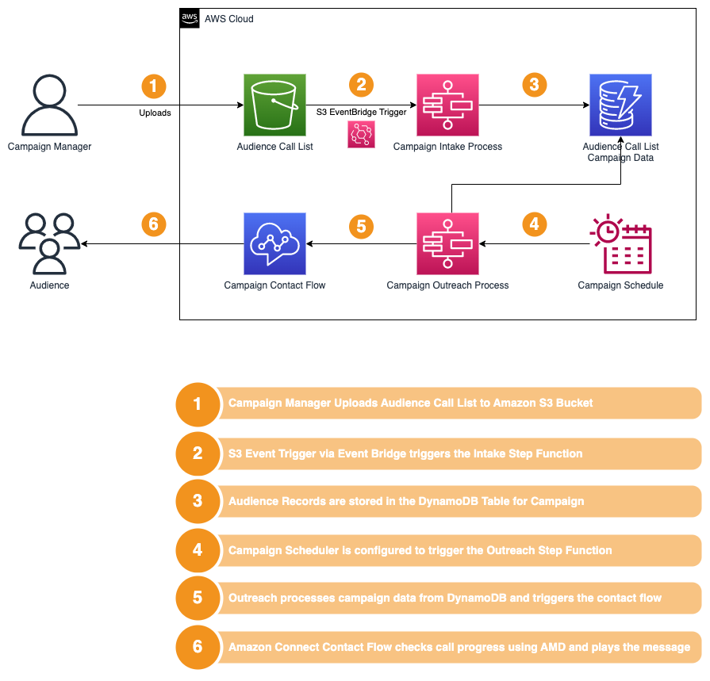


Below are the services that are required for deploying the solution.

* [Amazon Connect](https://docs.aws.amazon.com/connect/latest/adminguide/what-is-amazon-connect.html)
* [AWS StepFunctions](https://docs.aws.amazon.com/step-functions/latest/dg/welcome.html)
* [Amazon DynamoDB](https://docs.aws.amazon.com/amazondynamodb/latest/developerguide/Introduction.html)
* [AWS Lambda](https://docs.aws.amazon.com/lambda/latest/dg/welcome.html)
* [Amazon S3](https://docs.aws.amazon.com/AmazonS3/latest/userguide/Welcome.html)
* [Amazon EventBridge](https://docs.aws.amazon.com/eventbridge/latest/userguide/what-is-amazon-eventbridge.html)

## Deploy using AWS CDK

Follow the below steps to deploy this solution;

* Java 11 or later. If missing install Amazon Corretto Java 11 from [here](https://docs.aws.amazon.com/corretto/latest/corretto-11-ug/what-is-corretto-11.html).
```shell
java -version
```
* Maven 3.8 or later. If missing install Maven from [here](https://maven.apache.org/download.cgi).
* Note: Java version showed in the below output should be 11 or later.
```shell
mvn -version
```
* AWS CLI. If missing install AWS CLI from [here](https://docs.aws.amazon.com/cli/latest/userguide/install-cliv2.html).
```shell
aws --version
```

* Node.js 18.x or later. If missing install Node.js from [here](https://nodejs.org/en/download/).
```shell
node -v
```

* AWS CDK - Install the [AWS CDK Toolkit](https://docs.aws.amazon.com/cdk/v2/guide/cli.html) globally using the following command:
```shell
npm install -g aws-cdk
```
```shell
cdk --version
```

* **Important Note:**
  * Amazon Connect Instance per account limit is 2 (soft limit). 
  * If you already have 2 Amazon Connect instances, you will not be able to deploy this solution.
  * Either delete one of the Amazon Connect instances or request for quota increase [here](https://console.aws.amazon.com/servicequotas/home/services/connect/quotas/L-AA17A6B9).
  * Amazon Connect supported regions [here](https://docs.aws.amazon.com/connect/latest/adminguide/regions.html)

* CDK Bootstrap - Bootstrap your AWS account for CDK. This only needs to be done once per account/region.
```shell
cdk bootstrap aws://<account>/<region>
```

### Installation

Clone the repository and navigate to the project directory.
```shell
git clone <repo-url>
cd amazon-connect-agentless-outbound-campaign
```

### Build
Run below build command from the root directory of the project.
```shell
mvn clean install
```

### Deployment

Change to the Infra directory of the project.
```shell
cd Infra
```

Run the below command to deploy this solution.
```shell
cdk deploy
```

Below is the sample output of the CDK deploy command.
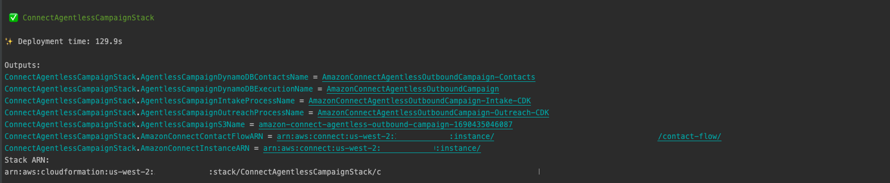

Below is the sample output of the Cloudformation Stack created by CDK.
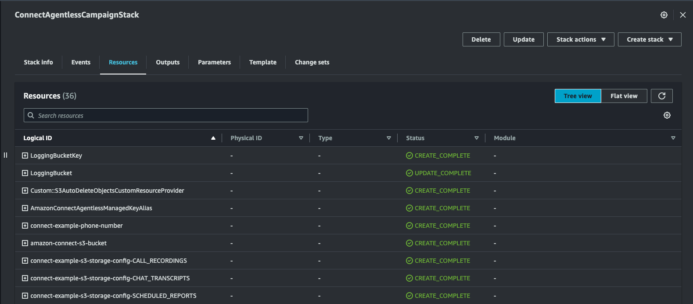

Navigate to the Amazon Connect instance, and enable the feature as shown below;
This feature is required by [check-call-progress](https://docs.aws.amazon.com/connect/latest/adminguide/check-call-progress.html) Flow block used for Automatic Machine Detection(AMD).
* Amazon Connect instance with Outbound campaigns enabled.
  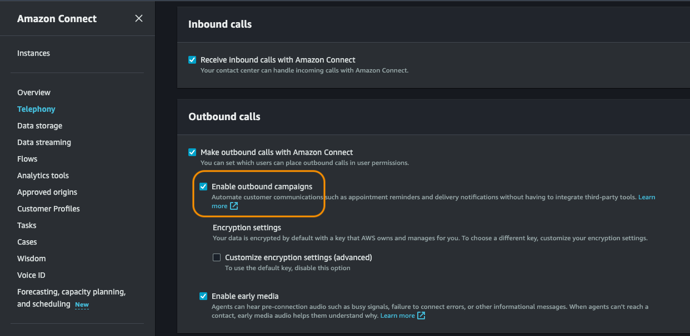

* Navigate to Amazon Connect Portal by clicking on "Emergency Access" as shown on the screenshot below;
  * Note: You can create User for any future access to Amazon Connect Portal. 
  * Please follow the steps on how to create User. [here](https://docs.aws.amazon.com/connect/latest/adminguide/user-management.html)

  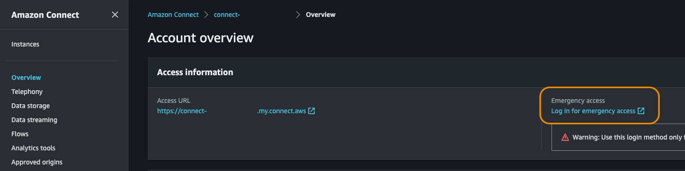 

* CDK will claim a toll-free phone number in order to make outbound calls.
* Navigate to Queues and click on 'Basic Queue' to modify the Default Outbound Caller ID name and number. [here](https://docs.aws.amazon.com/connect/latest/adminguide/queues-callerid.html)
* Modify the Default Outbound Caller ID name and number as shown in the below screenshot.
  * Default Caller ID name: Any Medicaid Company
  * Outbound Caller ID number: Select the number claimed by CDK
  * Click on Save.
  * 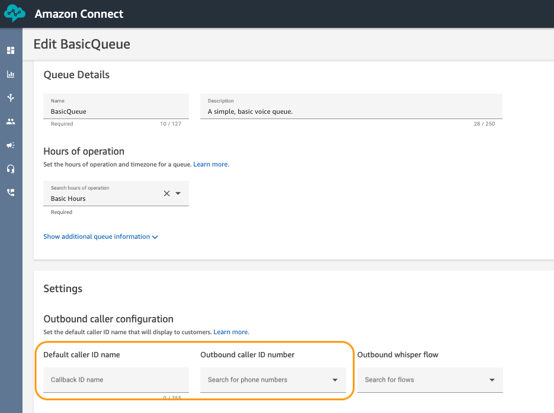


## Intake Process

### Step 1: Upload Contact List to S3 Bucket

Navigate to your Amazon S3 bucket with unprocessed folder as shown in the below screenshot.


1. Download this sample CSV file [Sample CSV File](Connect/ContactList/contact_example_import.csv)
2. Open in Text Editor (**Don't open in Excel** as it will change the format of the file)
3. Replace the phone number with your valid number E164 format. Example: +12345678901
4. Upload the sample CSV file(contact_example_import.csv) to the unprocessed folder with your valid number.

Important Note: 
1. Make sure you are uploading numbers that you own or have permission to call.
2. Both Amazon S3 and Amazon DynamoDB where Data is stored are encrypted by this solution.
3. Amazon Connect Outbound Campaign Voice calling is available only in the [these](https://docs.aws.amazon.com/connect/latest/adminguide/regions.html#campaigns_region) countries.
4. File name (contact_example_import.csv) should not be changed. If you want to change the filename then don't forget to change the filename in the Step Function Intake process as well.

### Step 2: Confirm the DynamoDB Tables created by CDK
Below is the detail of the AmazonConnectAgentlessOutboundCampaign-Contacts table created by CDK.

* This will be used to store the contact list imported from the S3 bucket.
* 
* | Attribute Name | Attribute Type | Key Type |
* 
* | phoneNumber | String | Primary Key |
* 
* | userLanguage | String | Sort Key |


Below is the detail of the AmazonConnectAgentlessOutboundCampaign table created by CDK.

* This will be used to store the campaign execution details.
* 
* | Attribute Name | Attribute Type | Key Type |
* 
* | campaignExecutionId | String | Primary Key |
* 
* | phoneNumber | String | Sort Key |

### Step 2: Execute the AWS Step Function for Intake Process

This step will import the contacts from the S3 bucket to the DynamoDB table created by CDK.

Navigate to the Step Functions Console and click on the Step Function created by CDK.
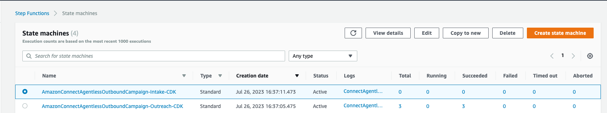

Click on the Step Function name which ends with '-Intake-CDK' and click on View details -> Start Execution.
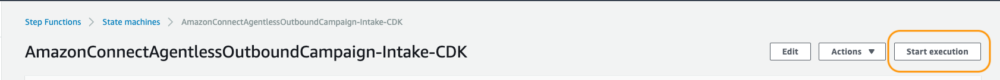

Once the execution is completed successfully as shown below;
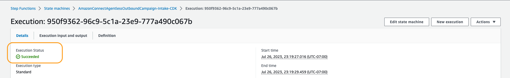

Now all the contacts should be imported to the DynamoDB table.

Navigate to Amazon DynamoDB Console and click on the table name which ends with '-Contacts' and click on Items to verify the import.


### Step 3: Execute the AWS Step Function for Outreach Process

This step will make outbound calls using Amazon Connect and capture the execution details in the DynamoDB table created by CDK.

Navigate to the Step Functions Console and click on the Step Function created by CDK.


Click on the Step Function name which ends with '-Outreach-CDK' and click on View details -> Start Execution.
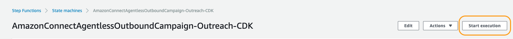

Once the execution is completed successfully as shown below;
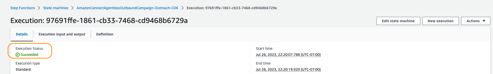

If you are using your mobile number in the contact list, you should receive a call from the Amazon Connect instance.

Navigate to Amazon DynamoDB Console and click on the table name which ends with 'AmazonConnectAgentlessOutboundCampaign' and click on Items to verify the execution information.

### Step 4 [Optional] : Create an EventBridge Rule for triggering the Step Function Intake Process when a new file is uploaded to the S3 bucket

### Step 5 [Optional] : Create an EventBridge Schedule for triggering the Step Function Outreach Process at regular intervals

### Cleanup
Run the below command to delete this solution.
```shell
cdk destroy
```
Note: Most of the resources created by this solution will be deleted.
1. KMS Keys will be marked for deletion in 7 days.
2. Cloudwatch Log Groups of some of the resources may need manual deletion.